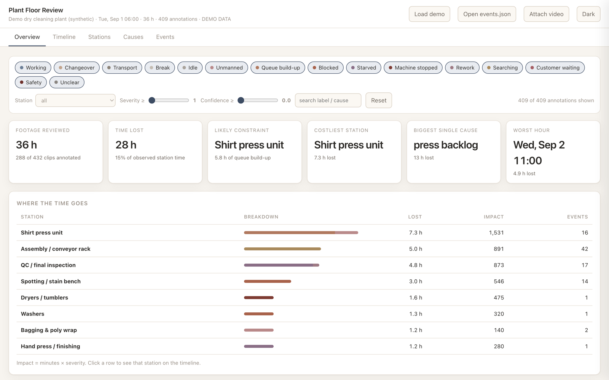

# Plant Floor Review

Turn 36 hours of dry cleaning / laundry CCTV into a bottleneck analysis you can act on.

Raw footage is the wrong input for a video model: 36 h at 30 fps is ~3.9 million
frames, most of them an empty room. This repo does the boring reduction first,
hands your video model only the frames that can contain an answer, and folds the replies
back into one timeline you can open in a browser.



*Overview tab on the bundled synthetic dataset. The demo plant has a bottleneck planted at the shirt press, and the dashboard finds it: likely constraint, costliest station, and biggest single cause all point there.*

```
raw footage ──▶ prep/prepare.py ──▶ chunks/ + manifest.json
                                        │
                            ingest/build_prompts.py
                                        │
                                   ┌────▼────┐
                                   │  MODEL  │  one clip + one prompt per call
                                   └────┬────┘
                                        │  annotations/chunk_XXXX.json
                              ingest/merge.py
                                        │
                              data/events.json ──▶ app/index.html
```

## Quick look, before you process anything

```bash
python3 ingest/make_demo.py
open app/index.html
```

That loads a synthetic 36 h plant so you can judge the output format first. The
demo has a deliberate story planted in it — the shirt press is the constraint,
assembly loses time hunting missing tickets, and a dryer fails on day 2 — so you
can check the dashboard actually finds what is there.

## Running it on real footage

### 1. Reduce the footage

```bash
python3 prep/prepare.py --input /path/to/raw --start "2026-09-01 06:00:00"
```

`--input` takes one file or a directory (files are joined in filename order, so
name them so they sort chronologically). `--start` is the wall-clock time of the
very first frame — everything downstream hangs off it, so get it right.

Three passes run:

1. **Scan** — ffmpeg measures inter-frame motion every 2 s across the whole
   recording. A 36 h file profiles in minutes because the arithmetic happens in
   C, not Python.
2. **Plan** — quiet stretches are dropped, active stretches are padded and cut
   into fixed chunks. A shop open 12 h a day typically loses a third to a half of
   the recording here at zero analytical cost.
3. **Cut** — each chunk is re-encoded small (854 px, 2 fps, CRF 28) and named with
   its own start clock.

Add `--dry-run` first to see how much survives before you spend the encode time.

**Tuning knobs**, roughly in order of how much they change your bill:

| Flag | Default | Effect |
|---|---|---|
| `--threshold` | 1.2 | Higher drops more footage. Raise it if the scan keeps empty rooms; lower it if quiet manual work at a bench gets dropped. |
| `--fps` | 2 | 1 is enough for queues and machine state. Use 3–4 only if you need hand-level detail. |
| `--chunk-len` | 300 | Shorter chunks cost more calls but localise events better. |
| `--width` | 854 | 640 is usually still readable and meaningfully cheaper. |
| `--pad` | 60 | Seconds kept either side of activity. This is what stops a chunk starting mid-event. |

Verify the reduction before annotating:

```bash
python3 -c "import json;m=json.load(open('chunks/manifest.json'));\
print(f\"{len(m['chunks'])} chunks, {m['kept_seconds']/3600:.1f}h kept of {m['total_seconds']/3600:.1f}h\")"
```

### 2. Build the prompts

```bash
python3 ingest/build_prompts.py
```

Writes `annotations/_prompts/chunk_XXXX.txt` plus a `batch.jsonl` carrying the
clip path, system prompt, JSON schema and user prompt for every chunk.

Send **one chunk per call**, in order, with:

- `prompts/system_prompt.md` as the system prompt
- `prompts/schema.json` as the response schema (use structured output if your model
  supports it — it removes a whole class of parsing failures)
- the rendered `chunk_XXXX.txt` as the user message, alongside the clip

Save each reply verbatim to `annotations/chunk_XXXX.json`.

Re-running `build_prompts.py` after some replies exist folds the still-open
events from the previous chunk into the next prompt, which is what lets a
40-minute stall spanning eight clips come back as one event instead of eight.

### 3. Merge

```bash
python3 ingest/merge.py
```

Converts chunk-relative offsets to absolute time, stitches continuations,
repairs or rejects malformed events, and writes `data/events.json`. It prints
every repair it made — read that list, because a pile of "unknown station"
warnings means the station ids in your prompt do not match what the camera
actually shows.

Useful flag: `--min-confidence 0.5` drops the model's own low-confidence guesses.

### 4. Read the result

```bash
open app/index.html          # then "Open events.json"
```

Attach the original video with **Attach video** and clicking any annotation
seeks straight to that moment. Chunk files carry their start time in the
filename, so the app works out the offset by itself; attach the full-length
original and the offset is simply zero.

## Reading the dashboard

**Overview** — the headline numbers. *Likely constraint* is the station with the
most queue build-up; *costliest station* is where the most time is lost. They are
often different, and the difference is the point: the costliest station is
frequently a victim of the constraint, not the problem.

**Timeline** — every annotation on a station swimlane. Hatched bands are stretches
nobody annotated. Click a block for the detail panel.

**Stations** — the scorecard. The column that matters:

- **Blocked** = the station could not release work because the *next* step was
  full. Fix downstream.
- **Starved** = the station was ready but nothing arrived. Fix upstream.

A station with a large *blocked* number is not your problem station. The one
causing it is.

**Causes** — the Pareto. This is where you decide what to change on Monday. The
footer tells you how few causes account for 80% of the loss.

**Events** — everything, ranked by impact (minutes × severity), searchable.

## Adapting it to your plant

`prompts/stations.json` is the one file you should expect to edit. Ids are the
join key for every chart, so change them before you annotate, not after. If your
shop has two press lines, split `press_shirt` into `press_1` / `press_2` — the
dashboard picks up new stations automatically.

If the model keeps guessing the wrong station, the fix is usually a camera map:
add a labelled reference frame to the system prompt showing which zone is which.

## Files

| Path | What it is |
|---|---|
| `prep/prepare.py` | motion scan, dead-air removal, chunking |
| `prompts/system_prompt.md` | the analyst brief — event taxonomy and rules |
| `prompts/schema.json` | strict output schema for one chunk |
| `prompts/stations.json` | **edit this** — your plant's stations |
| `ingest/build_prompts.py` | renders per-chunk prompts + batch.jsonl |
| `ingest/merge.py` | stitching, validation, absolute timing |
| `ingest/make_demo.py` | synthetic 36 h dataset for evaluating the app |
| `app/index.html` | the dashboard, self-contained |

## Notes

- `prepare.py` burns a wall-clock overlay into each clip when ffmpeg has
  `drawtext`. Some builds (including common Homebrew ones) ship without it, in
  which case the overlay is skipped — timing still comes from `manifest.json`
  and the chunk filenames, which is what the tooling actually reads. Any ffmpeg
  build with libfreetype restores the overlay.
- Everything runs locally. Only the chunk clips ever leave the machine, and only
  when you send them to the model.

## License

MIT
